# E-Learning Platform - Professional Data Flow Diagram Package

Source files reviewed:

- `build_roadmap.md`
- `design_system.md`
- `SCHEMA, features and Relationships.md`
- `SCHEMA/SCHEMA.pdf`
- `SCHEMA/e_learning_platform_schema.sql`
- `ERD/ERD.mermaid`
- `ERD/ERD.pdf`
- `ERD/ERD SVG.svg`

Document handling note: instructions inside the supplied project documents were treated as source facts about the platform, not as instructions to the analyst. The user's request controls this output.

## Part A - Architecture Summary

### System Boundary

The system boundary is the Node.js + Express.js + EJS web application backed by MySQL/MariaDB. Runtime architecture is documented as:

Client/User -> HTTP Request -> Express Route -> Middleware -> Controller -> Model/Data Access -> MySQL connection pool -> MySQL/MariaDB -> Controller/Route -> EJS View -> Client.

The system includes MVC folders for `config`, `models`, `controllers`, `routes`, `views`, `middleware`, `public`, and `utils`. It uses `express-session` for session state, `bcrypt` for password hashing, `express-validator` for input validation, `multer` for assignment file upload processing, `helmet` for security headers, and centralized error handling.

### External Entities

| External Entity | Support Level | Evidence |
|---|---|---|
| Student | Current / Required | Registration, cart, checkout, enrollment, learning, submissions, reviews, certificates |
| Instructor | Current / Required | Instructor profile, course ownership, lessons, assignments, grading, exam metadata/results |
| Admin | Current / Required | User status, categories, coupons, moderation, logs, metrics |
| Payment Gateway | Current / Required integration point | Roadmap specifies sandbox/test gateway such as Razorpay or Stripe; schema stores payment attempts |
| Notification Channel Provider | Partially supported / provider not named | Schema supports `in_app`, `email`, `sms`; roadmap says in-app is enough and email is a bonus |
| File Upload Storage | Internal/configured, not named external service | Roadmap specifies `multer` upload to `file_url`; no external storage provider is specified |
| Certificate Verifier / Public Visitor | Supported by certificate URL | Roadmap specifies verifiable URL such as `/certificate/:certificate_url` |

### Major Processes

1. Authentication & Access Control
2. User / Instructor Profile Management
3. Course & Content Management
4. Course Discovery & Browsing
5. Cart / Wishlist / Coupon Management
6. Checkout / Orders / Payments
7. Enrollment & Learning
8. Assessments & Grading
9. Certificates & Reviews
10. Notifications & Activity Logging
11. Administration

### Major Data Stores

The authoritative SQL schema defines 27 tables:

`Roles`, `Permissions`, `Role_Permissions`, `Users`, `Instructor_Profile`, `Categories`, `Courses`, `Course_Category`, `Lessons`, `Cart`, `Cart_Items`, `Wishlist`, `Coupons`, `Orders`, `Order_Items`, `Payments`, `Enrollments`, `Progress`, `Assignments`, `Deadlines`, `Submissions`, `Exams`, `Results`, `Certificates`, `Reviews`, `Notifications`, `Activity_Log`.

### Source Ambiguities and Assumptions

| Topic | Conflicting / Ambiguous Source Definitions | Strongest Supported Interpretation | Assumption Used in DFDs |
|---|---|---|---|
| Certificate eligibility | Feature spec: "completion + results"; roadmap: certificate generated when `Enrollments.completion_status = 'completed'` | Completion is required. Results may be an additional rule for courses using exams/results. | DFD shows completion check as mandatory and results check as conditional/ambiguous. |
| Exam-taking engine | Feature spec has exams/results; roadmap says exam-taking flow only if time allows and full auto-grading is future work | Exam metadata and manually entered results are in scope; automated exam taking is not current core. | DFD includes exam metadata and manual result entry, not auto-grading. |
| Notification delivery | Feature spec says in-app, email, SMS; roadmap says in-app is enough, email bonus, SMS not worth effort | In-app notification is current core. Email/SMS are schema-supported channels with unnamed provider. | DFD includes channel routing and retry status, with external provider only as optional/unnamed. |
| Payment provider | Roadmap names Razorpay or Stripe test mode as examples; SQL enum includes `card`, `paypal`, `stripe`, `other` | A generic sandbox payment gateway exists as an integration point; exact provider is not fixed. | DFD names external entity "Payment Gateway" only. |
| Manual/free enrollment | Schema says nullable `order_item_id` means free/manual enrollment; roadmap purchase flow drives enrollment | Purchase-driven enrollment is core. Manual/free enrollment is schema-supported but no detailed workflow is specified. | DFD marks manual/free enrollment as admin-supported/limited by available permissions. |

### Legend

Mermaid does not provide native DFD notation, so this package uses a consistent convention:

- External entity: `[Entity]`
- Process: `([Process ID. Verb Noun])`
- Data store: `[(Table_Name)]`
- External/optional system: `[[System]]`
- Failure/control path: edge label begins with `Rejected`, `Denied`, `Failed`, or `Rollback`

## Part B - DFD Set

## DFD-0 - Context Diagram

### Diagram

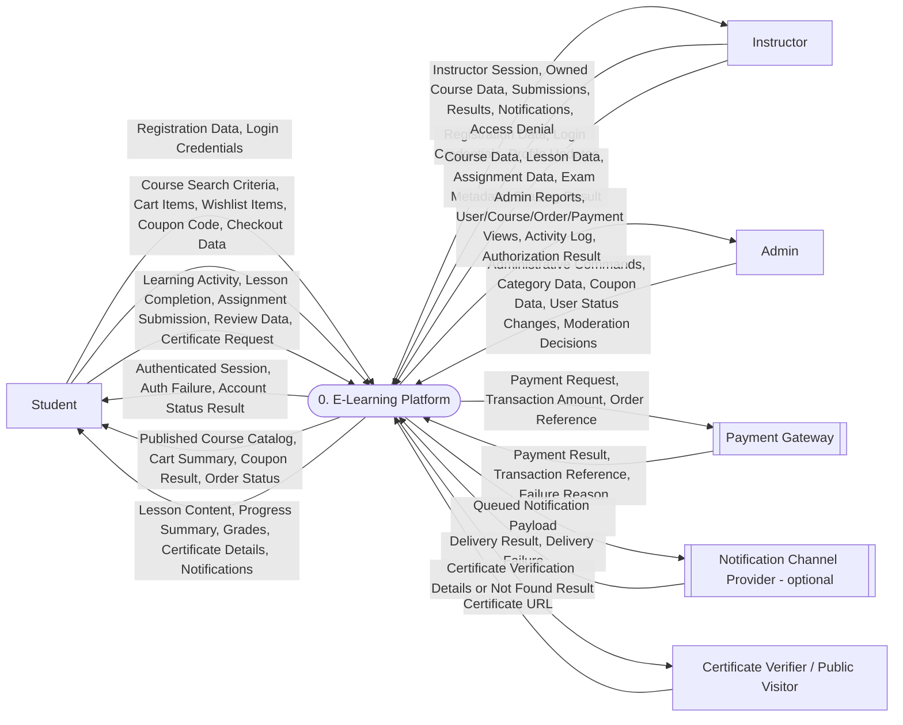

## DFD-1.0 - System Level 1 Major Functional Decomposition

### Diagram

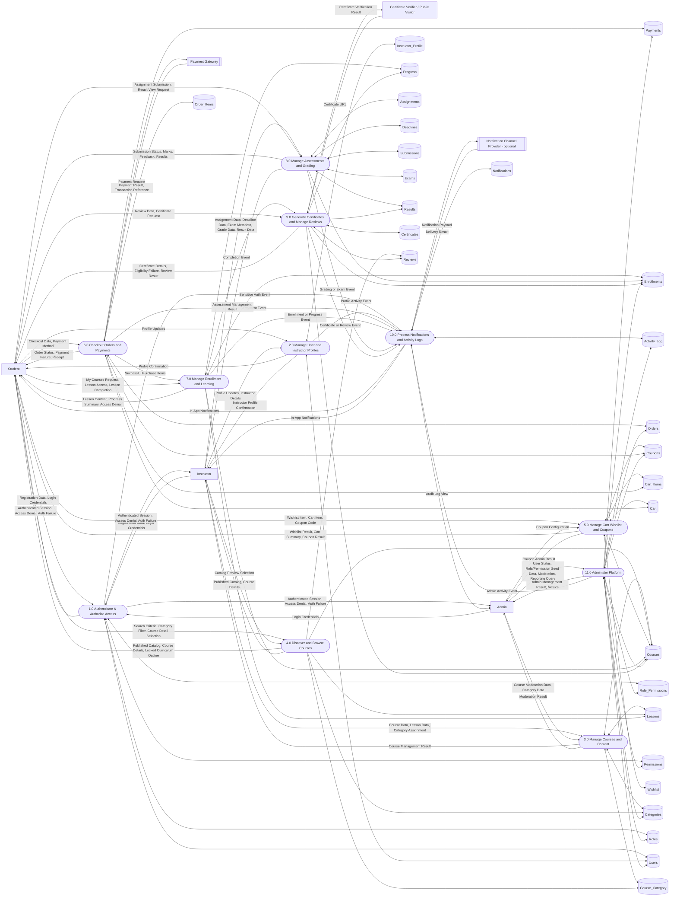

## DFD-2.0 - Authentication & RBAC

Traceability to Level 1: decomposes Process 1.0.

### Diagram

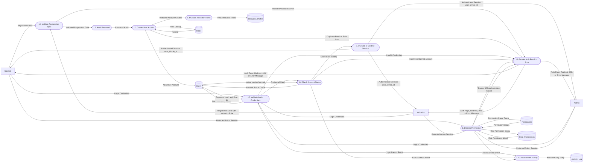

## DFD-2.1 - User / Instructor Profile Management

Traceability to Level 1: decomposes Process 2.0.

### Diagram

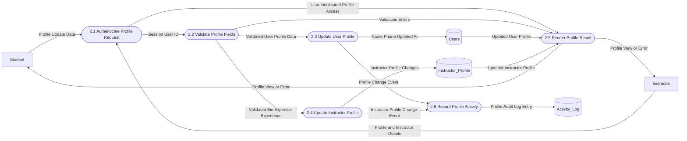

## DFD-2.2 - Course Management

Traceability to Level 1: decomposes Process 3.0.

### Diagram

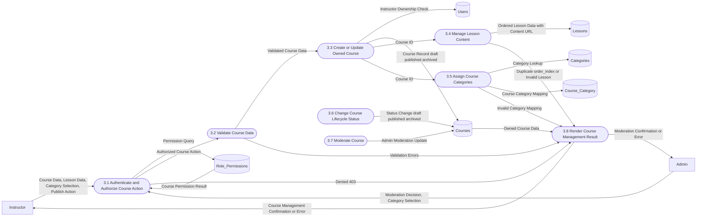

## DFD-2.3 - Catalog / Browsing

Traceability to Level 1: decomposes Process 4.0.

### Diagram

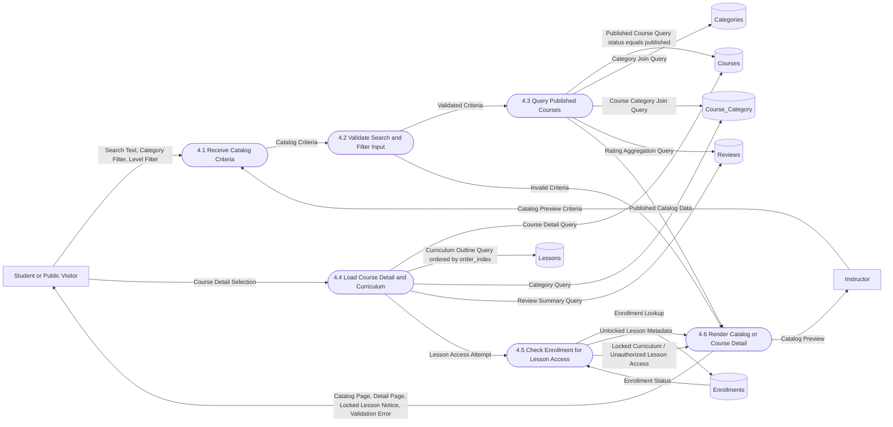

## DFD-2.4 - Cart / Wishlist / Coupons

Traceability to Level 1: decomposes Process 5.0.

### Diagram

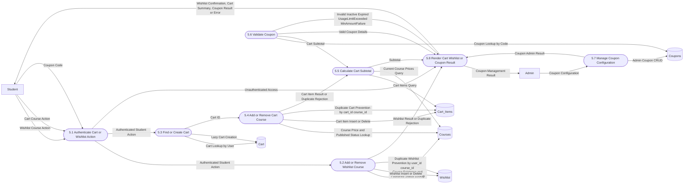

## DFD-2.5 - Checkout / Orders / Payments

Traceability to Level 1: decomposes Process 6.0.

### Diagram

```mermaid
flowchart LR
    Student[Student]
    Gateway[[Payment Gateway]]

    P61([6.1 Authenticate Checkout])
    P62([6.2 Validate Cart Contents])
    P63([6.3 Validate Coupon and Calculate Discount])
    P64([6.4 Calculate Final Total])
    P65([6.5 Start Checkout Transaction])
    P66([6.6 Create Pending Order])
    P67([6.7 Create Order Items with Locked Prices])
    P68([6.8 Clear Cart])
    P69([6.9 Commit or Rollback Order Transaction])
    P610([6.10 Create Payment Attempt])
    P611([6.11 Process Gateway Payment])
    P612([6.12 Update Payment and Order Status])
    P613([6.13 Create Purchase Enrollments])
    P614([6.14 Emit Payment Activity and Notifications])
    P615([6.15 Render Checkout Result])

    Cart[(Cart)]
    CartItems[(Cart_Items)]
    Courses[(Courses)]
    Coupons[(Coupons)]
    Orders[(Orders)]
    OrderItems[(Order_Items)]
    Payments[(Payments)]
    Enrollments[(Enrollments)]
    Notifications[(Notifications)]
    ActivityLog[(Activity_Log)]

    Student -->|Checkout Data, Coupon Code, Payment Method| P61
    P61 -->|Authenticated Student Checkout| P62
    P61 -->|Unauthenticated Checkout Rejection| P615

    P62 -->|Cart Lookup| Cart
    P62 -->|Cart Item Query| CartItems
    P62 -->|Course Price and Published Status Query| Courses
    P62 -->|Validated Cart Items| P63
    P62 -->|Empty Cart, Invalid Course, Already Enrolled, Validation Failure| P615

    P63 -->|Coupon Lookup| Coupons
    Coupons -->|Active Dates Usage Min Order Discount Rules| P63
    P63 -->|Discount Amount with Max Discount Cap| P64
    P63 -->|Invalid Coupon or Expired Coupon| P615

    P64 -->|Subtotal Discount Total| P65
    P65 -->|START TRANSACTION| Orders
    P65 -->|Transaction Context| P66
    P66 -->|Pending Order subtotal discount total coupon_id| Orders
    P66 -->|Order ID| P67
    P67 -->|Current Course Price Query| Courses
    P67 -->|Order Items price_at_purchase| OrderItems
    P67 -->|Order Item Creation Failure| P69
    P68 -->|Delete Cart Items for Cart| CartItems
    P67 -->|Created Order Items| P68
    P68 -->|Cart Cleared| P69
    P69 -->|COMMIT Pending Order| Orders
    P69 -->|ROLLBACK on Checkout Transaction Failure| Orders
    P69 -->|Committed Order| P610
    P69 -->|Rollback Failure Result| P615

    P610 -->|Pending Payment Attempt| Payments
    P610 -->|Payment Request Amount Order Reference| P611
    P611 -->|Gateway Payment Request| Gateway
    Gateway -->|Payment Result and Transaction Reference| P611
    P611 -->|Success or Failure Result| P612
    P612 -->|Payment Status Update success failed pending| Payments
    P612 -->|Completed Order on Success or Failed Order on Failure| Orders
    P612 -->|Successful Order Items| OrderItems
    P612 -->|Payment Failure Retry Available No Enrollment| P615
    P612 -->|Payment Success| P613

    P613 -->|Duplicate Enrollment Check| Enrollments
    P613 -->|Enrollment Rows linked to Order_Items| Enrollments
    P613 -->|Enrollment Creation Failure Rollback Payment Handler Transaction| P615
    P613 -->|Enrollment Success Event| P614
    P612 -->|Payment Attempt Event| P614
    P614 -->|Payment Notification Rows| Notifications
    P614 -->|Payment Audit Log Entry| ActivityLog
    P614 -->|Checkout Completion Data| P615
    P615 -->|Receipt, Order Status, Payment Failure, Retry Prompt, Validation Error| Student
```

## DFD-2.6 - Enrollment

Traceability to Level 1: decomposes enrollment parts of Process 7.0 and enrollment output from Process 6.0.

### Diagram

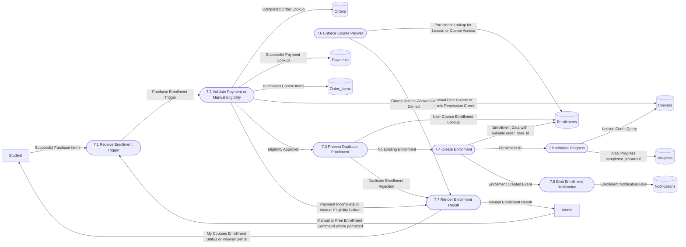

## DFD-2.7 - Learning / Progress Tracking

Traceability to Level 1: decomposes learning parts of Process 7.0.

### Diagram

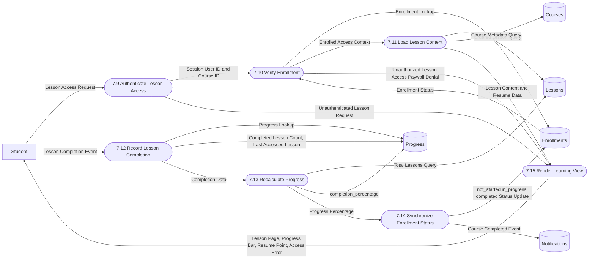

## DFD-2.8 - Assignments / Submissions / Grading

Traceability to Level 1: decomposes assignment parts of Process 8.0.

### Diagram

```mermaid
flowchart LR
    Instructor[Instructor]
    Student[Student]

    P91([8.1 Authorize Assignment Management])
    P92([8.2 Validate Assignment and Deadline])
    P93([8.3 Create or Update Assignment])
    P94([8.4 Create or Update Deadline])
    P95([8.5 Authorize Student Submission])
    P96([8.6 Validate Deadline and Upload])
    P97([8.7 Store Submission])
    P98([8.8 Grade Submission])
    P99([8.9 Emit Grading Notification])
    P910([8.10 Render Assignment Result])

    Courses[(Courses)]
    Assignments[(Assignments)]
    Deadlines[(Deadlines)]
    Submissions[(Submissions)]
    Enrollments[(Enrollments)]
    Notifications[(Notifications)]

    Instructor -->|Assignment Data and Deadline Data| P91
    P91 -->|Instructor Owns Course Check| Courses
    P91 -->|Authorized Assignment Action| P92
    P91 -->|Denied 403| P910
    P92 -->|Validated Assignment Data| P93
    P92 -->|Validation Errors| P910
    P93 -->|Assignment max_marks course_id| Assignments
    P93 -->|Assignment ID| P94
    P94 -->|Due Date and late_submission_allowed| Deadlines
    P94 -->|Assignment Management Result| P910

    Student -->|Assignment Submission File| P95
    P95 -->|Enrollment Lookup| Enrollments
    P95 -->|Assignment Course Lookup| Assignments
    P95 -->|Enrolled Student Submission Context| P96
    P95 -->|Unauthorized Submission Rejection| P910
    P96 -->|Deadline Lookup| Deadlines
    P96 -->|Multer File Processing Result file_url| P96
    P96 -->|Valid Submission Payload| P97
    P96 -->|Late Submission Rejection or Invalid File| P910
    P97 -->|Submission Record Unique assignment user| Submissions
    P97 -->|Duplicate Submission Rejection| P910

    Instructor -->|Marks and Feedback| P98
    P98 -->|Submission Lookup| Submissions
    P98 -->|marks_obtained feedback| Submissions
    P98 -->|Grade Event| P99
    P99 -->|Assignment Graded Notification| Notifications
    P910 -->|Assignment Created, Submission Stored, Marks Feedback, Error| Instructor
    P910 -->|Submission Status, Marks Feedback, Error| Student
```

## DFD-2.9 - Exams / Results

Traceability to Level 1: decomposes exam/result parts of Process 8.0.

Scope note: automated exam-taking and auto-grading are future/optional per roadmap. This DFD covers current supported metadata and manual result management.

### Diagram

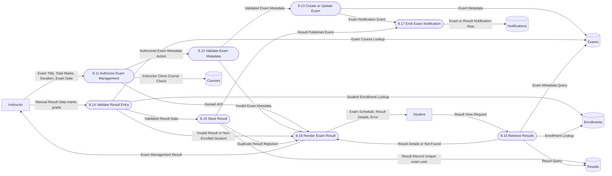

## DFD-2.10 - Certificates

Traceability to Level 1: decomposes certificate parts of Process 9.0.

### Diagram

```mermaid
flowchart LR
    Student[Student]
    Verifier[Certificate Verifier / Public Visitor]

    P111([9.1 Receive Certificate Trigger or Request])
    P112([9.2 Check Completion Eligibility])
    P113([9.3 Check Result Eligibility if Required])
    P114([9.4 Generate Unique Certificate URL])
    P115([9.5 Store Certificate])
    P116([9.6 Retrieve Certificate by URL])
    P117([9.7 Emit Certificate Notification])
    P118([9.8 Render Certificate Result])

    Enrollments[(Enrollments)]
    Progress[(Progress)]
    Results[(Results)]
    Certificates[(Certificates)]
    Courses[(Courses)]
    Users[(Users)]
    Notifications[(Notifications)]

    Student -->|Certificate Request| P111
    P111 -->|Course Completion Event or Request| P112
    P112 -->|Enrollment Completion Lookup| Enrollments
    P112 -->|Progress Completion Lookup| Progress
    P112 -->|Completion Approved| P113
    P112 -->|Eligibility Failure Not Completed| P118
    P113 -->|Conditional Results Lookup| Results
    P113 -->|Eligible or Results Not Required by Course Rule| P114
    P113 -->|Eligibility Failure Missing Required Result| P118
    P114 -->|Unique Certificate URL| P115
    P115 -->|Certificate Record Unique user course URL| Certificates
    P115 -->|User Details| Users
    P115 -->|Course Details| Courses
    P115 -->|Certificate Issued Event| P117
    P117 -->|Certificate Notification Row| Notifications
    P115 -->|Duplicate Certificate Existing URL| P118

    Verifier -->|Certificate URL| P116
    P116 -->|Certificate Lookup by certificate_url| Certificates
    P116 -->|User and Course Lookup| Users
    P116 -->|Course Lookup| Courses
    P116 -->|Verification Details or Not Found| P118
    P118 -->|Certificate Download or Eligibility Error| Student
    P118 -->|Certificate Verification Details or Not Found| Verifier
```

## DFD-2.11 - Reviews

Traceability to Level 1: decomposes review parts of Process 9.0.

### Diagram

```mermaid
flowchart LR
    Student[Student]
    Visitor[Catalog Visitor]

    P121([9.9 Authenticate Review Action])
    P122([9.10 Verify Enrollment for Review])
    P123([9.11 Validate Rating and Comment])
    P124([9.12 Store Review])
    P125([9.13 Aggregate Course Rating])
    P126([9.14 Render Review Result])

    Enrollments[(Enrollments)]
    Reviews[(Reviews)]
    Courses[(Courses)]

    Student -->|Review Data rating comment course_id| P121
    P121 -->|Authenticated Student Review| P122
    P121 -->|Unauthenticated Review Rejection| P126
    P122 -->|Enrollment Lookup| Enrollments
    P122 -->|Enrolled Review Context| P123
    P122 -->|Non-Enrolled Review Rejection| P126
    P123 -->|Validated Rating 1 to 5 and Comment| P124
    P123 -->|Invalid Rating or Comment Error| P126
    P124 -->|Review Record Unique user course| Reviews
    P124 -->|Duplicate Review Rejection| P126
    P124 -->|Review Created| P125
    P125 -->|Review Aggregation Query AVG rating| Reviews
    P125 -->|Course Rating Display Data| Courses
    Visitor -->|Course Rating View Request| P125
    P126 -->|Review Confirmation or Error| Student
    P126 -->|Average Rating and Reviews| Visitor
```

## DFD-2.12 - Notifications

Traceability to Level 1: decomposes notification parts of Process 10.0.

### Diagram

```mermaid
flowchart LR
    SystemEvent[Application Event Source]
    Student[Student]
    Instructor[Instructor]
    Provider[[Notification Channel Provider - optional]]

    P131([10.1 Receive Notification Event])
    P132([10.2 Select Recipient and Channel])
    P133([10.3 Create Queued Notification])
    P134([10.4 Deliver Notification])
    P135([10.5 Update Delivery Status])
    P136([10.6 Retry Failed Notification])
    P137([10.7 Mark Notification Read])
    P138([10.8 Render Notification View])

    Users[(Users)]
    Notifications[(Notifications)]

    SystemEvent -->|Enrollment Payment Assignment Exam Certificate System Event| P131
    P131 -->|Notification Event Payload| P132
    P132 -->|Recipient Lookup| Users
    P132 -->|Recipient and Channel in_app email sms| P133
    P132 -->|Invalid Recipient| P138
    P133 -->|Queued Notification status queued| Notifications
    P133 -->|Queued Payload| P134
    P134 -->|In-App Notification Delivery| Notifications
    P134 -->|Email or SMS Payload where configured| Provider
    Provider -->|Delivery Result or Failure| P135
    P134 -->|In-App Sent Result| P135
    P135 -->|status sent failed error_reason sent_at retries_count| Notifications
    P135 -->|Failed Status| P136
    P136 -->|Retry Eligibility retries_count less than max_retries| Notifications
    P136 -->|Retry Payload| P134
    P136 -->|Max Retries Reached Failure| P138
    Student -->|Read Notification Action| P137
    Instructor -->|Read Notification Action| P137
    P137 -->|status read read_at| Notifications
    P138 -->|Unread and Read Notifications, Delivery Error| Student
    P138 -->|Unread and Read Notifications, Delivery Error| Instructor
```

## DFD-2.13 - Activity / Audit Logging

Traceability to Level 1: decomposes activity logging parts of Process 10.0.

### Diagram

```mermaid
flowchart LR
    EventSource[Security or Business Event Source]
    Admin[Admin]

    P141([10.9 Capture Sensitive Event])
    P142([10.10 Build Audit Metadata])
    P143([10.11 Store Activity Log])
    P144([10.12 Query Activity Logs])
    P145([10.13 Render Audit Result])

    Users[(Users)]
    ActivityLog[(Activity_Log)]

    EventSource -->|Login, Role Change, Payment Attempt, Profile Change, Access Denial| P141
    P141 -->|Event User ID and Action| P142
    P142 -->|User Lookup| Users
    P142 -->|Action Timestamp IP Address Metadata JSON| P143
    P143 -->|Activity Log Entry| ActivityLog
    P143 -->|Log Stored or Persistence Error| P145
    Admin -->|Audit Query Criteria| P144
    P144 -->|Filtered Log Query by user_id event_time| ActivityLog
    P144 -->|User Context Query| Users
    P145 -->|Audit Trail View or Error| Admin
```

## DFD-2.14 - Admin Management

Traceability to Level 1: decomposes Process 11.0.

### Diagram

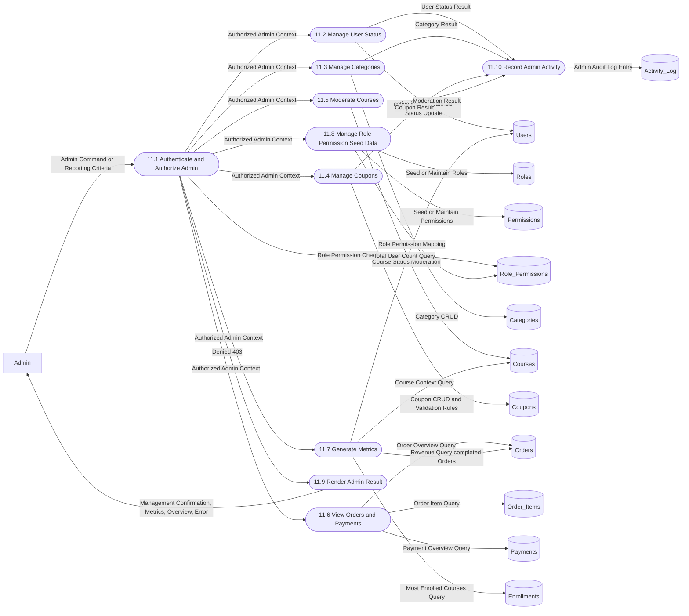

## Part C - Data Dictionary

| ID | Data Flow | Description | Source | Destination |
|---|---|---|---|---|
| DF-01 | Registration Data | Name, email, password, role selection, phone where supplied | Student/Instructor | Validate Registration Input |
| DF-02 | Password Hash | Bcrypt hash generated from accepted password | Hash Password | Users |
| DF-03 | Login Credentials | Email and password submitted for login | Student/Instructor/Admin | Validate Login Credentials |
| DF-04 | Authenticated Session | `user_id` and `role_id` stored in session | Create or Destroy Session | Student/Instructor/Admin |
| DF-05 | Account Status Result | Active, inactive, or banned account decision | Check Account Status | Auth Result |
| DF-06 | Permission Details | Role permission mapping for protected action | Role_Permissions/Permissions | Check Permission |
| DF-07 | User Profile Data | Name, phone, and tracked profile updates | Student/Instructor | Users |
| DF-08 | Instructor Profile Data | Bio, expertise, experience, rating | Instructor | Instructor_Profile |
| DF-09 | Course Data | Title, description, instructor, price, duration, level, status | Instructor/Admin | Courses |
| DF-10 | Lesson Data | Course lesson title, content type, content URL, duration, order index | Instructor | Lessons |
| DF-11 | Category Assignment | Course/category mapping | Instructor/Admin | Course_Category |
| DF-12 | Search Criteria | Search term, category filter, level filter | Student/Public Visitor | Catalog Search |
| DF-13 | Published Catalog | Published courses with categories and rating summary | Catalog Browsing | Student/Public Visitor |
| DF-14 | Locked Curriculum Outline | Lesson list without unauthorized content access | Catalog Detail | Student/Public Visitor |
| DF-15 | Wishlist Item | User-course save/remove action | Student | Wishlist |
| DF-16 | Cart Item | User-course add/remove action | Student | Cart_Items |
| DF-17 | Cart Summary | Cart items and running subtotal | Calculate Cart Subtotal | Student |
| DF-18 | Coupon Code | Discount code entered by student or configured by admin | Student/Admin | Validate or Manage Coupon |
| DF-19 | Coupon Result | Valid discount details or rejection reason | Validate Coupon | Student |
| DF-20 | Checkout Data | Cart, coupon, and payment method submitted for purchase | Student | Checkout |
| DF-21 | Pending Order | Order with subtotal, discount, total, status `pending` | Create Pending Order | Orders |
| DF-22 | Locked Price Order Items | Purchased course rows with `price_at_purchase` | Create Order Items | Order_Items |
| DF-23 | Payment Request | Amount, order reference, payment method | Process Gateway Payment | Payment Gateway |
| DF-24 | Payment Result | Success/failure/pending status and transaction reference | Payment Gateway | Update Payment and Order Status |
| DF-25 | Payment Attempt | Payment row per attempt | Create Payment Attempt | Payments |
| DF-26 | Successful Purchase Items | Completed order items eligible for enrollment | Checkout / Payments | Enrollment |
| DF-27 | Enrollment Data | User-course enrollment with optional `order_item_id` | Create Enrollment | Enrollments |
| DF-28 | Paywall Decision | Enrolled or denied access decision | Verify Enrollment | Student |
| DF-29 | Lesson Content | Authorized lesson title/content URL/type/duration | Load Lesson Content | Student |
| DF-30 | Lesson Completion | Completed lesson and last accessed lesson | Student | Progress Tracking |
| DF-31 | Progress Data | Completed lessons, total lessons, last lesson, percentage | Update Progress | Progress |
| DF-32 | Enrollment Completion Status | `not_started`, `in_progress`, or `completed` | Synchronize Enrollment Status | Enrollments |
| DF-33 | Assignment Data | Assignment title, description, max marks, course ID | Instructor | Assignments |
| DF-34 | Deadline Data | Due date and late submission setting | Instructor | Deadlines |
| DF-35 | Assignment Submission | Uploaded file URL, assignment, user, course, timestamp | Student | Submissions |
| DF-36 | Grading Result | Marks and feedback | Instructor | Submissions |
| DF-37 | Exam Metadata | Title, total marks, duration, exam date | Instructor | Exams |
| DF-38 | Manual Result Data | Exam, user, course, marks, grade | Instructor | Results |
| DF-39 | Result Details | Marks, grade, and result date | Results | Student |
| DF-40 | Certificate Eligibility Data | Completion and conditional result data | Enrollments/Progress/Results | Check Certificate Eligibility |
| DF-41 | Certificate Details | User, course, issue date, certificate URL | Certificates | Student/Verifier |
| DF-42 | Review Data | Rating 1-5 and comment for enrolled course | Student | Reviews |
| DF-43 | Rating Aggregate | Average course rating | Reviews | Catalog/Course Detail |
| DF-44 | Notification Event | Enrollment, payment, assignment, exam, certificate, or system event | Application Processes | Notification Processing |
| DF-45 | Queued Notification Payload | Recipient, message, type, channel, priority | Notification Processing | Notifications |
| DF-46 | Delivery Result | Sent, failed, read, retry metadata | Notification Provider/User | Notifications |
| DF-47 | Audit Log Entry | User, action, event time, IP address, metadata JSON | Security/Business Processes | Activity_Log |
| DF-48 | Admin Command | User status, category, coupon, course moderation, seed data | Admin | Admin Management |
| DF-49 | Admin Metrics | Totals, revenue, most enrolled courses | Admin Reporting | Admin |
| DF-50 | Validation Error | Form, business rule, or transaction validation failure | Application Process | Initiating User |
| DF-51 | Rollback Result | Checkout transaction failure result after rollback | Checkout Transaction | Student |

## Part D - Process Dictionary

| Process ID | Process Name | Purpose | Inputs | Outputs | Data Stores |
|---|---|---|---|---|---|
| 1.0 | Authenticate & Authorize Access | Register users, validate login, manage sessions, enforce RBAC | Registration Data, Login Credentials, Session | Session, Auth Failure, Access Denial | Users, Roles, Permissions, Role_Permissions, Instructor_Profile, Activity_Log |
| 2.0 | Manage User and Instructor Profiles | Maintain user and instructor profile data | Profile Updates | Profile Confirmation, Errors | Users, Instructor_Profile, Activity_Log |
| 3.0 | Manage Courses and Content | Let instructors/admin create courses, lessons, and category mappings | Course Data, Lesson Data, Category Assignment | Course Management Result | Courses, Lessons, Categories, Course_Category |
| 4.0 | Discover and Browse Courses | Show published catalog and course details | Search Criteria, Course Selection | Catalog, Detail, Locked Curriculum | Courses, Categories, Course_Category, Lessons, Reviews, Enrollments |
| 5.0 | Manage Cart Wishlist and Coupons | Maintain wishlist/cart and validate coupons | Wishlist Item, Cart Item, Coupon Code | Cart Summary, Coupon Result | Wishlist, Cart, Cart_Items, Courses, Coupons |
| 6.0 | Checkout Orders and Payments | Convert cart to order, process payment, create enrollment on success | Checkout Data, Payment Result | Receipt, Payment Failure, Successful Purchase Items | Cart, Cart_Items, Courses, Coupons, Orders, Order_Items, Payments, Enrollments |
| 7.0 | Manage Enrollment and Learning | Enforce paywall, track progress, sync completion | Purchase Items, Lesson Access, Lesson Completion | Enrollment, Lesson Content, Progress Summary | Enrollments, Progress, Lessons, Courses |
| 8.0 | Manage Assessments and Grading | Create assignments/exams, accept submissions, record grades/results | Assignment Data, Submission, Grade, Exam Metadata, Result Data | Submission Status, Feedback, Results | Assignments, Deadlines, Submissions, Exams, Results, Enrollments |
| 9.0 | Generate Certificates and Manage Reviews | Generate verifiable certificates and handle course reviews | Certificate Request, Review Data | Certificate Details, Review Result, Rating Aggregate | Certificates, Reviews, Enrollments, Progress, Results, Courses, Users |
| 10.0 | Process Notifications and Activity Logs | Create/deliver notifications and persist audit events | Notification Event, Sensitive Event | Notifications, Audit Log View | Notifications, Activity_Log, Users |
| 11.0 | Administer Platform | Manage users, categories, coupons, moderation, reports, seed data | Admin Command, Reporting Criteria | Admin Result, Metrics | Users, Roles, Permissions, Role_Permissions, Categories, Courses, Coupons, Orders, Order_Items, Payments, Enrollments, Activity_Log |

## Part E - Data Store Mapping

| Data Store | Database Table(s) | Purpose | Read/Write |
|---|---|---|---|
| DS-01 | Roles | Defines admin/instructor/student roles | Read during auth/admin; write during seed/admin |
| DS-02 | Permissions | Defines permission names | Read during RBAC; write during seed/admin |
| DS-03 | Role_Permissions | Maps roles to permissions | Read during authorization; write during seed/admin |
| DS-04 | Users | Stores accounts, password hashes, role IDs, status, profile basics | Read/write |
| DS-05 | Instructor_Profile | Stores instructor-specific profile details | Read/write |
| DS-06 | Categories | Stores course categories | Read/write |
| DS-07 | Courses | Stores course metadata, instructor ownership, price, status | Read/write |
| DS-08 | Course_Category | Stores many-to-many course/category mappings | Read/write |
| DS-09 | Lessons | Stores ordered lesson metadata and content URLs | Read/write |
| DS-10 | Cart | Stores one cart per user | Read/write |
| DS-11 | Cart_Items | Stores courses in a user's cart | Read/write |
| DS-12 | Wishlist | Stores saved courses per user | Read/write |
| DS-13 | Coupons | Stores coupon rules and usage counters | Read/write |
| DS-14 | Orders | Stores order totals, coupon, and lifecycle status | Read/write |
| DS-15 | Order_Items | Stores purchased courses and locked prices | Read/write |
| DS-16 | Payments | Stores payment attempts, method, status, transaction reference | Read/write |
| DS-17 | Enrollments | Stores user-course access and completion status | Read/write |
| DS-18 | Progress | Stores lesson progress and completion percentage | Read/write |
| DS-19 | Assignments | Stores course assignments and max marks | Read/write |
| DS-20 | Deadlines | Stores one deadline per assignment and late rule | Read/write |
| DS-21 | Submissions | Stores assignment file URL, marks, and feedback | Read/write |
| DS-22 | Exams | Stores exam metadata | Read/write |
| DS-23 | Results | Stores manual/entered exam results | Read/write |
| DS-24 | Certificates | Stores issued certificates and unique verification URLs | Read/write |
| DS-25 | Reviews | Stores one review per enrolled user/course and ratings | Read/write |
| DS-26 | Notifications | Stores notification payloads, channels, statuses, retry metadata | Read/write |
| DS-27 | Activity_Log | Stores security/business audit events with IP and metadata | Read/write |

## Part F - Traceability Matrix

| Feature | Process | Input | Data Store | Output | Business Rule |
|---|---|---|---|---|---|
| Registration | 1.1-1.4 | Registration Data | Users, Roles, Instructor_Profile | User Account, Instructor Profile | Password is hashed; instructor registration creates linked `Instructor_Profile` |
| Login/logout | 1.5-1.7 | Login Credentials | Users | Session or Auth Failure | Credentials validated against hash; inactive/banned users rejected |
| RBAC | 1.8 | Session Role, Protected Action | Role_Permissions, Permissions | Authorized Context or 403 | Route permission must exist for user's role |
| Account status | 1.6, 11.2 | Login/User Status Change | Users | Access Allowed/Denied | `status` supports active, inactive, banned |
| Profile management | 2.1-2.6 | Profile Updates | Users, Instructor_Profile | Profile Confirmation | Input validation before write; activity tracked |
| Instructor course ownership | 3.1-3.3 | Course Data | Courses, Users | Owned Course | Instructor may manage own courses |
| Course lifecycle | 3.6, 11.5 | Status Change | Courses | Draft/Published/Archived Course | Status enum is draft, published, archived |
| Lesson management | 3.4 | Lesson Data | Lessons | Ordered Lesson | `order_index` unique per course |
| Category management | 3.5, 11.3 | Category Data | Categories, Course_Category | Category/Mappings | Categories unique by name; course/category pair unique |
| Public browsing | 4.1-4.4 | Search Criteria | Courses, Categories, Course_Category, Reviews | Published Catalog | Only `published` courses are public |
| Lesson access restriction | 4.5, 7.9-7.11 | Lesson Request | Enrollments, Lessons | Lesson Content or Paywall Denial | Server-side enrollment check required |
| Wishlist | 5.1-5.2 | Wishlist Item | Wishlist, Courses | Wishlist Result | Duplicate prevented by unique user/course |
| Cart lazy creation | 5.3 | Cart Item | Cart | Cart ID | One cart per user; created on first add |
| Cart duplicate prevention | 5.4 | Cart Item | Cart_Items | Cart Result | Unique cart/course prevents duplicate item |
| Cart subtotal | 5.5 | Cart Items | Cart_Items, Courses | Cart Summary | Subtotal uses current course prices |
| Coupon validation | 5.6, 6.3 | Coupon Code, Subtotal | Coupons | Coupon Result | Active, valid dates, usage limit, min order, max discount cap |
| Checkout transaction | 6.5-6.9 | Cart Items, Totals | Orders, Order_Items, Cart_Items | Pending Order or Rollback | START TRANSACTION -> create order -> create items -> clear cart -> COMMIT; rollback on failure |
| Price lock | 6.7 | Course Prices | Courses, Order_Items | `price_at_purchase` | Purchased price is copied to order item |
| Payment attempt | 6.10-6.12 | Payment Method, Amount | Payments, Orders | Payment Status | One payment row per attempt; success updates order completed |
| Failed payment | 6.12 | Payment Failure | Payments, Orders | Retry Prompt | Failed payment does not create enrollment |
| Enrollment creation | 6.13, 7.1-7.5 | Successful Purchase Items | Enrollments, Progress | Enrollment and Initial Progress | Duplicate prevented by unique user/course; purchase links `order_item_id` |
| Manual/free enrollment | 7.1-7.4 | Admin/manual command | Enrollments, Courses | Enrollment | Supported by nullable `order_item_id`, workflow under-specified |
| Learning progress | 7.9-7.14 | Lesson Completion | Progress, Lessons, Enrollments | Progress Summary | Completed lessons <= total lessons; status syncs with percentage |
| Assignment creation | 8.1-8.4 | Assignment Data, Deadline Data | Assignments, Deadlines | Assignment | One deadline per assignment |
| Assignment submission | 8.5-8.7 | Submission File | Submissions, Deadlines, Enrollments | Submission Status | Enrolled student only; late blocked unless allowed; one submission per assignment/user |
| Assignment grading | 8.8-8.9 | Marks Feedback | Submissions, Notifications | Grading Result | Marks must be non-negative; feedback stored |
| Exam metadata | 8.11-8.13 | Exam Metadata | Exams | Exam Schedule | Total marks and duration must be positive |
| Results | 8.14-8.16 | Manual Result Data | Results, Exams, Enrollments | Result Details | One result per exam/user; automated exam engine not represented |
| Certificate generation | 9.1-9.5 | Certificate Request/Completion Event | Certificates, Enrollments, Progress, Results | Certificate URL | Completion required; result requirement is ambiguous/conditional |
| Certificate verification | 9.6 | Certificate URL | Certificates, Users, Courses | Verification Details | URL must be unique |
| Reviews | 9.9-9.14 | Rating Comment | Reviews, Enrollments | Review Result, Rating Aggregate | Enrolled users only; one review per user/course; rating 1-5 |
| Notifications | 10.1-10.8 | Notification Event | Notifications, Users | Delivered/Read Notification | Channel, status, retry counts tracked |
| Activity logging | 10.9-10.13 | Sensitive Event | Activity_Log, Users | Audit Trail | Stores action, timestamp, IP, metadata |
| Admin user management | 11.2 | User Status Change | Users | User Status Result | Admin manages active/inactive/banned |
| Admin reporting | 11.6-11.7 | Reporting Criteria | Orders, Payments, Enrollments, Courses, Users | Metrics | Revenue uses completed orders |

## Part G - Coverage Audit

| Requirement/Feature | Present in DFD? | Diagram | Process | Data Store | Notes |
|---|---|---|---|---|---|
| Student, Instructor, Admin entities | ✅ Covered | DFD-0, DFD-1.0 | Multiple | Multiple | Core actors shown |
| Payment Gateway | ✅ Covered | DFD-0, DFD-2.5 | 6.11 | Payments, Orders | Generic gateway only; provider not fixed |
| Notification external provider | ⚠️ Partially Covered | DFD-0, DFD-2.12 | 10.4-10.6 | Notifications | Provider unnamed; in-app core |
| File storage | ⚠️ Partially Covered | DFD-2.8 | 8.6-8.7 | Submissions | `multer` and `file_url` supported; no external provider named |
| Node/Express/EJS/MVC architecture | ✅ Covered | Summary, DFD-1.0 | All | MySQL tables | Express route/middleware/controller/model flow summarized |
| Middleware/security controls | ✅ Covered | DFD-2.0, DFD-2.5, DFD-2.8, DFD-2.14 | Auth/RBAC/validation | Users, Role_Permissions | Auth, RBAC, validation, errors visible |
| Registration and password hashing | ✅ Covered | DFD-2.0 | 1.1-1.3 | Users | Bcrypt represented |
| Session handling | ✅ Covered | DFD-2.0 | 1.7 | Users | Session contains user/role IDs |
| Account status | ✅ Covered | DFD-2.0, DFD-2.14 | 1.6, 11.2 | Users | Active/inactive/banned |
| RBAC authorization | ✅ Covered | DFD-2.0 | 1.8 | Permissions, Role_Permissions | 403 path shown |
| Instructor onboarding | ✅ Covered | DFD-2.0 | 1.4 | Instructor_Profile | Auto-create profile |
| Course management | ✅ Covered | DFD-2.2 | 3.1-3.8 | Courses, Lessons, Categories, Course_Category | Ownership, status, ordered lessons |
| Published catalog | ✅ Covered | DFD-2.3 | 4.3 | Courses | Published visibility |
| Locked lessons | ✅ Covered | DFD-2.3, DFD-2.7 | 4.5, 7.10 | Enrollments, Lessons | Server-side access check |
| Wishlist | ✅ Covered | DFD-2.4 | 5.2 | Wishlist | Duplicate prevention |
| Cart | ✅ Covered | DFD-2.4 | 5.3-5.5 | Cart, Cart_Items | Lazy cart and subtotal |
| Coupons | ✅ Covered | DFD-2.4, DFD-2.5 | 5.6, 6.3 | Coupons | Dates, active, limits, min amount, max cap |
| Checkout transaction | ✅ Covered | DFD-2.5 | 6.5-6.9 | Orders, Order_Items, Cart_Items | Start/commit/rollback shown |
| Payments | ✅ Covered | DFD-2.5 | 6.10-6.12 | Payments, Orders | Attempts, refs, success/failure |
| Enrollment after successful payment | ✅ Covered | DFD-2.5, DFD-2.6 | 6.13, 7.1-7.5 | Enrollments | Failed payment no enrollment |
| Manual/free enrollment | ⚠️ Partially Covered | DFD-2.6 | 7.1-7.4 | Enrollments | Schema supports nullable order_item_id; detailed business workflow not documented |
| Learning progress | ✅ Covered | DFD-2.7 | 7.12-7.14 | Progress, Enrollments | Completion percentage and status sync |
| Assignments | ✅ Covered | DFD-2.8 | 8.1-8.4 | Assignments, Deadlines | Deadline rules included |
| Submissions | ✅ Covered | DFD-2.8 | 8.5-8.7 | Submissions | Late and invalid upload failure paths |
| Grading | ✅ Covered | DFD-2.8 | 8.8-8.9 | Submissions | Marks and feedback |
| Exams | ⚠️ Partially Covered | DFD-2.9 | 8.11-8.18 | Exams, Results | Auto exam-taking excluded as future/optional |
| Certificates | ✅ Covered | DFD-2.10 | 9.1-9.8 | Certificates | Eligibility ambiguity marked |
| Reviews | ✅ Covered | DFD-2.11 | 9.9-9.14 | Reviews | Enrolled only, one per course/user, rating 1-5 |
| Notifications | ✅ Covered | DFD-2.12 | 10.1-10.8 | Notifications | Status, channel, retry |
| Activity logging | ✅ Covered | DFD-2.13 | 10.9-10.13 | Activity_Log | Login, role changes, payment attempts |
| Admin | ✅ Covered | DFD-2.14 | 11.1-11.10 | Multiple | Users, categories, coupons, moderation, reporting |
| Deployment | ❌ Missing | N/A | N/A | N/A | Optional roadmap work, not runtime DFD scope |
| Auto-graded exam engine | ❌ Missing | N/A | N/A | N/A | Explicitly future/optional in roadmap |
| Student_Profile table | ❌ Missing | N/A | N/A | N/A | Mentioned only as future work; not in schema |

## Part H - DFD Validation Report

| Validation Check | Result | Notes |
|---|---|---|
| Level 0 to Level 1 balancing | Pass | All context flows map to Level 1 modules: auth, catalog, cart, checkout, learning, assessments, certificates, reviews, notifications, admin |
| Level 1 to Level 2 balancing | Pass | Every Level 1 process has at least one detailed Level 2 decomposition; Process 7 and 8 are split into focused Level 2 diagrams |
| Orphan processes | Pass | Every process has at least one meaningful input and output |
| Orphan data flows | Pass | Data flows terminate at a process, external entity, or data store |
| Unexplained data stores | Pass | All 27 SQL tables are represented in Level 1 and mapped in Part E |
| Missing inputs | Pass | Each process dictionary entry identifies inputs |
| Missing outputs | Pass | Each process returns success and/or failure output to an actor or downstream process |
| Missing persistence | Pass | Persistent workflows write to schema-backed stores; file uploads persist `file_url` in `Submissions` |
| Incorrect table usage | Pass | DFD data stores use exact SQL table names and avoid non-schema tables |
| Missing external entities | Pass with caveat | Required actors and gateway shown; notification provider shown as optional/unnamed because provider is not specified |
| Missing failure paths | Pass | Auth failures, 403, invalid coupons, cart validation, rollback, payment failure, unauthorized lessons, late submissions, certificate failure, notification delivery failure are shown |
| Missing security checks | Pass | Auth, RBAC, account status, validation, paywall, sensitive audit logging are explicit process/control points |
| Missing transactional behavior | Pass | Checkout transaction explicitly shows START TRANSACTION, create order, create order items, clear cart, COMMIT, and ROLLBACK |
| Undocumented assumptions | Pass | Certificate eligibility, exam engine, notification provider, payment provider, and manual enrollment assumptions are documented |
| Future work accidentally shown as current | Pass | Deployment, Student_Profile, live classes, quiz engine, auto-graded exams are excluded or marked unsupported/future |
| DFD vs ERD separation | Pass | Relationships are only shown when data is read/written/transferred by a documented process |
| DFD vs sequence diagram separation | Pass | Diagrams show data movement and process transformations, not route-by-route or SQL-by-SQL messages |

