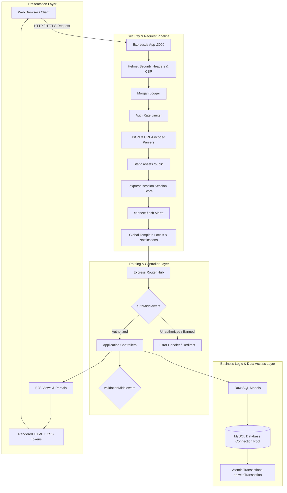
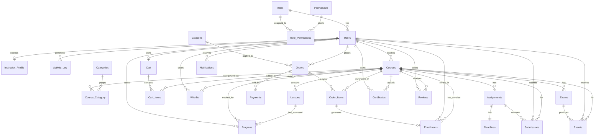

# E-Learning Platform

> A full-stack, enterprise-grade E-Learning & Academic Credentialing Web Application built with **Node.js**, **Express.js**, **EJS**, and **MySQL**, featuring robust Role-Based Access Control (RBAC), multi-course transactional checkout, automated progress tracking, verifiable digital certification, assignments, exams, and a unified administration dashboard.

---

## 📖 Overview

The **E-Learning Platform** is a monolithic server-rendered web application engineered to deliver an end-to-end digital learning and credentialing ecosystem. Built without heavyweight ORMs or complex frontend frameworks, it uses raw parameterized SQL queries with `mysql2` and clean MVC architecture to ensure maximum performance, security, and maintainability.

### The Problem It Solves
Modern education and certification platforms often suffer from fragmented architectures, fragile ORM abstractions, and poor alignment between learning completion and credential verification. This platform unites the full student lifecycle—from course discovery, coupon-driven checkout, and video/document content consumption to deadline-enforced assignment grading, instructor exam scoring, and cryptographic-style verifiable certificate issuance—backed by an immutable audit trail and administrative moderation tools.

### Target Users
- **👨‍🎓 Students / Learners**: Discover courses, manage wishlists and shopping carts, redeem coupons, checkout via a test gateway, consume ordered lessons, track learning progress, submit assignments, view exam results, earn verifiable certificates, and post reviews.
- **👩‍🏫 Instructors**: Manage rich instructor profiles, create and maintain multi-lesson curricula, attach categories, set assignment deadlines, grade student submissions with custom feedback, and enter exam scores.
- **🛡️ Administrators**: Oversee platform health via aggregated KPI analytics, manage categories, issue/toggle coupons, moderate course publishing lifecycles, inspect orders and payment transactions, manage user account states (active/inactive/banned) with real-time session revocation, and audit system activity logs.

---

## ✨ Features

### 👨‍🎓 Student / Learner Features
- **Catalog Browsing & Search**: Filter published courses by search query, category, and skill level (`beginner`, `intermediate`, `advanced`).
- **Wishlist & Persistent Cart**: Save courses for later or assemble multi-course carts for single-transaction checkout.
- **Coupons & Discounts**: Apply promotional codes (`percent` or `flat` discounts) with automated validation for order minimums, max discount caps, expiry dates, and usage limits.
- **Transactional Checkout & Payment Gateway**: Multi-course order creation locking prices at purchase time, paired with a sandbox test payment gateway supporting success and failure simulation.
- **Instant Auto-Enrollment**: Automatic enrollment and learning progress row initialization immediately upon successful payment transaction.
- **Gated Learning Player**: Access unlocked, ordered video and document lessons with a responsive curriculum sidebar, active lesson indicators, and resume capability.
- **Real-Time Progress Tracking**: Dynamic lesson completion tracking that synchronizes course completion percentage and enrollment state (`not_started` ➔ `in_progress` ➔ `completed`).
- **Assignment Submissions**: Download assignment briefs and upload submission files (`.pdf`, `.png`, `.jpg`, `.jpeg`, `.doc`, `.docx`, `.zip`) before deadlines, with automatic late submission enforcement.
- **Exam Results**: View scored exam results, grades, and instructor remarks.
- **Verifiable Certificates**: Automatically generate a tamper-evident digital certificate upon 100% course completion, accessible via a public shareable verification URL with print-to-PDF formatting.
- **Course Reviews & Ratings**: Submit 1-to-5-star ratings and written feedback (strictly restricted to enrolled students, one review per course).
- **In-App Notification Inbox**: Centralized inbox for real-time notifications on enrollments, payments, assignment grades, exam results, and certificates, complete with a live unread badge count.

### 👩‍🏫 Instructor Features
- **Transactional Instructor Registration**: Automatic provisioning of `Users` and `Instructor_Profile` (bio, expertise, experience years, rating) records within an atomic database transaction.
- **Instructor Workspace & Dashboard**: Dedicated dashboard displaying owned courses, active students, enrollment metrics, and pending assessment tasks.
- **Course Lifecycle Management**: Create, edit, and manage courses with multi-category associations; toggle course states between `draft`, `published`, and `archived`.
- **Curriculum & Lesson Builder**: Create, update, re-order, and delete lessons with custom titles, content types (`video`, `document`, `quiz`, `other`), content URLs, and durations.
- **Assignment Management & Grading**: Create assignments with deadlines, maximum marks, and late-submission flags; inspect student submissions, assign marks, and return feedback.
- **Exam & Result Management**: Schedule course exams with total marks and durations; manually enter and update student marks and letter grades.
- **Automated Event Notifications**: Trigger instant in-app alerts to enrolled students whenever assignments are graded or exam results are published.

### 🛡️ Administrator Features
- **Executive KPI Analytics**: High-level platform analytics powered by optimized SQL aggregations:
  - Total registered users (broken down by Students, Instructors, Admins).
  - Total revenue, completed orders, and active enrollments.
  - Course counts across draft, published, and archived states.
  - Overall platform completion rates and average course ratings.
- **User Management & Governance**: Inspect user accounts and update statuses (`active`, `inactive`, `banned`). Banned or deactivated accounts have active sessions terminated immediately via middleware.
- **Course Moderation**: Review and override course statuses across the entire platform.
- **Category Management**: Full CRUD operations for platform taxonomy with automated course-category link maintenance.
- **Coupon Management**: Create, configure, monitor usage statistics, and toggle activation status for promotional coupons.
- **Orders & Payments Inspection**: Detailed transaction logs and per-order breakdowns including subtotal, discount, final amount, payment method, and transaction references.
- **Activity & Audit Logging**: Searchable system audit trail recording user IDs, actions, IP addresses, timestamps, and JSON metadata for security and compliance.

### 🔐 Security & Architecture Highlights
- **No ORM Overhead**: Handcrafted, parameterized SQL queries using `mysql2/promise` connection pools to eliminate SQL injection risks.
- **Dynamic RBAC Middleware**: Two-tier authorization checking session roles against database permissions (`Roles` ➔ `Role_Permissions` ➔ `Permissions`).
- **Session Freshness Verification**: Real-time database checks on every authenticated request to immediately invalidate sessions of banned or inactive users.
- **Brute-Force Rate Limiting**: `express-rate-limit` protection on authentication routes.
- **Content Security & Headers**: `helmet` configured with strict Content Security Policies (CSP) supporting Google Fonts.
- **Atomic Database Transactions**: `db.withTransaction` ensures consistency across registration, checkout, payment processing, enrollment, progress recalculation, and multi-category tagging.
- **Bespoke Academic Design System**: Native CSS custom properties (`tokens.css`), Source Serif 4 headings, Inter body typography, gold achievement highlights, and responsive navigation drawers without heavy external UI dependencies.

---

## 🏗️ System Architecture

The application follows the **Model-View-Controller (MVC)** architectural pattern built on top of Express.js and MySQL:



### Runtime Data Flow
1. **Request Intake**: Incoming requests pass through security headers (`helmet`), request loggers (`morgan`), and rate limiters.
2. **Session & Auth Verification**: `express-session` retrieves session state, and `authMiddleware` validates user status and checks required RBAC permissions (`authorize('permission:name')`).
3. **Controller Execution**: Controllers validate inputs via `express-validator`, execute domain logic, and interact with data models.
4. **Data Persistence**: Models execute parameterized SQL queries or multi-statement transactions against the `mysql2` connection pool.
5. **View Rendering**: Controllers pass data to EJS templates styled with `tokens.css` and `styles.css`, returning server-rendered HTML to the client.

---

## 🗄️ Database Schema & Entities

The platform database contains **27 relational tables** covering user identity, course catalogs, e-commerce, progress, assessments, certifications, notifications, and audit logging.



### Table Breakdown by Module

| Module | Tables | Purpose & Key Relationships |
|---|---|---|
| **Identity & RBAC** | `Users`, `Roles`, `Permissions`, `Role_Permissions`, `Instructor_Profile` | User accounts with status control (`active`/`inactive`/`banned`), RBAC permission matrices, and instructor profile details. |
| **Catalog & Lessons** | `Courses`, `Categories`, `Course_Category`, `Lessons` | Multi-category course catalog, course metadata (level, duration, price), and sequentially ordered lessons (`order_index`). |
| **E-Commerce & Orders** | `Cart`, `Cart_Items`, `Wishlist`, `Coupons`, `Orders`, `Order_Items`, `Payments` | Persistent user carts, wishlist storage, discount calculation rules, multi-item orders locking `price_at_purchase`, and payment audit rows. |
| **Learning & Progress** | `Enrollments`, `Progress` | Enrollment verification, completed lesson counts, last-accessed lesson pointer, and percentage calculations. |
| **Assessments** | `Assignments`, `Deadlines`, `Submissions`, `Exams`, `Results` | Course assignments with deadline rules, student file submissions (`file_url`), grading & feedback, and exam results with letter grades. |
| **Credentials & Feedback** | `Certificates`, `Reviews`, `Notifications` | Publicly verifiable unique certificate records, 1–5 star course reviews, and user in-app notification dispatch queue. |
| **Auditing & Governance** | `Activity_Log` | Audit log tracking user actions, IP addresses, timestamps, and JSON event metadata. |

---

## 🛣️ Complete Route & Endpoint Reference

### 🔐 Authentication & Accounts
| Method | Endpoint | Access / Permission | Description |
|---|---|---|---|
| `GET` | `/login` | Public | Render login page |
| `POST` | `/login` | Public (Rate Limited) | Authenticate user credentials and create session |
| `GET` | `/register` | Public | Render registration page (Student / Instructor) |
| `POST` | `/register` | Public (Rate Limited) | Create user account (+ instructor profile if applicable) |
| `GET` / `POST` | `/logout` | Authenticated | Destroy session and log out |

### 📊 Dashboards & Profiles
| Method | Endpoint | Access / Permission | Description |
|---|---|---|---|
| `GET` | `/` | Public | Platform landing page with featured courses and hero preview |
| `GET` | `/dashboard` | Authenticated | Role-directed main dashboard (redirects or displays student overview) |
| `GET` | `/dashboard/instructor` | `course:create` | Instructor dashboard with course and assessment metrics |
| `GET` | `/dashboard/admin` | `user:manage` | Executive administrator dashboard with aggregated KPIs & audit logs |

### 📚 Course Catalog & Management
| Method | Endpoint | Access / Permission | Description |
|---|---|---|---|
| `GET` | `/courses` | Public | Filterable public course catalog |
| `GET` | `/courses/manage` | `course:create` | Instructor workspace listing owned courses |
| `GET` | `/courses/new` | `course:create` | Form to create a new course |
| `POST` | `/courses/new` | `course:create` | Process course creation with categories |
| `GET` | `/courses/:id` | Public | Course overview page with curriculum and reviews |
| `GET` | `/courses/:id/edit` | `course:edit` | Form to edit existing course (owner or Admin) |
| `POST` | `/courses/:id/edit` | `course:edit` | Update course details and category associations |
| `POST` | `/courses/:id/status` | `course:publish` | Toggle course lifecycle (`draft`/`published`/`archived`) |
| `POST` | `/courses/:id/delete` | `course:delete` | Delete course and associated relationships |

### 📖 Lesson Curriculum Management
| Method | Endpoint | Access / Permission | Description |
|---|---|---|---|
| `GET` | `/courses/:course_id/lessons` | `course:edit` | Lesson manager view for a course |
| `POST` | `/courses/:course_id/lessons` | `course:edit` | Add new ordered lesson to course |
| `POST` | `/courses/:course_id/lessons/:lesson_id/edit` | `course:edit` | Update lesson title, type, URL, duration, order |
| `POST` | `/courses/:course_id/lessons/:lesson_id/delete` | `course:edit` | Delete lesson from course |

### 🛒 Cart, Wishlist & Coupons
| Method | Endpoint | Access / Permission | Description |
|---|---|---|---|
| `GET` | `/cart` | Authenticated | View shopping cart, applied coupon, and total |
| `POST` | `/cart/add` | Authenticated | Add course to cart |
| `POST` | `/cart/remove` | Authenticated | Remove course item from cart |
| `POST` | `/cart/coupon` | Authenticated | Validate and apply promo coupon to active cart |
| `POST` | `/cart/coupon/remove` | Authenticated | Remove applied coupon from active cart |
| `GET` | `/wishlist` | Authenticated | View saved wishlist courses |
| `POST` | `/wishlist/add` | Authenticated | Add course to wishlist |
| `POST` | `/wishlist/remove` | Authenticated | Remove course from wishlist |

### 💳 Checkout, Orders & Payments
| Method | Endpoint | Access / Permission | Description |
|---|---|---|---|
| `POST` | `/checkout/initiate` | Authenticated | Create pending `Orders` and `Order_Items` from cart |
| `GET` | `/checkout/:order_id` | Authenticated | Render sandbox checkout payment simulation page |
| `POST` | `/checkout/:order_id/pay` | Authenticated | Process payment simulation (success triggers auto-enrollment) |
| `GET` | `/orders/:order_id/success` | Authenticated | View order receipt and enrollment confirmation |
| `GET` | `/orders` | Authenticated | View student order history |

### 🎓 Learning Experience & Certificates
| Method | Endpoint | Access / Permission | Description |
|---|---|---|---|
| `GET` | `/my-courses` | Authenticated | View enrolled courses with progress bars |
| `GET` | `/learn/:course_id` | Authenticated (Enrolled) | Resume course at last accessed lesson |
| `GET` | `/learn/:course_id/lessons/:lesson_id` | Authenticated (Enrolled) | Gated lesson video/document player view |
| `POST` | `/learn/:course_id/lessons/:lesson_id/complete` | Authenticated (Enrolled) | Mark lesson complete & recalculate progress % |
| `POST` | `/courses/:id/certificate` | Authenticated (Enrolled) | Request certificate upon 100% course completion |
| `GET` | `/certificate/:certificate_url` | Public | Publicly verifiable digital certificate view |

### 📝 Assessments (Assignments & Exams)
| Method | Endpoint | Access / Permission | Description |
|---|---|---|---|
| `GET` | `/courses/:course_id/assignments` | `course:browse` | View course assignments list |
| `POST` | `/courses/:course_id/assignments` | `course:edit` | Create course assignment with deadline |
| `GET` | `/courses/:course_id/assignments/:assignment_id` | `assignment:grade` | View assignment submissions list (Instructor/Admin) |
| `POST` | `/courses/:course_id/assignments/:assignment_id/submit` | `assignment:submit` | Upload student assignment file (Multer upload) |
| `POST` | `/courses/:course_id/assignments/:assignment_id/grade/:submission_id` | `assignment:grade` | Assign marks and feedback to submission |
| `GET` | `/courses/:course_id/exams` | `course:browse` | View course exams list |
| `POST` | `/courses/:course_id/exams` | `course:edit` | Create course exam metadata |
| `GET` | `/courses/:course_id/exams/:exam_id` | `assignment:grade` | View exam results overview |
| `POST` | `/courses/:course_id/exams/:exam_id/results` | `assignment:grade` | Enter/update student exam marks and grades |

### ⭐ Reviews & Notifications
| Method | Endpoint | Access / Permission | Description |
|---|---|---|---|
| `POST` | `/courses/:id/reviews` | Authenticated (Enrolled) | Submit 1–5 star course rating and review |
| `GET` | `/notifications` | Authenticated | View in-app notification inbox |
| `POST` | `/notifications/read-all` | Authenticated | Mark all notifications as read |
| `POST` | `/notifications/:notification_id/read` | Authenticated | Mark specific notification as read |

### 🛡️ Administration Routes
| Method | Endpoint | Access / Permission | Description |
|---|---|---|---|
| `GET` | `/admin/users` | `user:manage` | List all users with status management controls |
| `POST` | `/admin/users/:user_id/status` | `user:manage` | Update user status (`active`/`inactive`/`banned`) |
| `GET` | `/admin/courses` | `user:manage` | List all platform courses for moderation |
| `POST` | `/admin/courses/:course_id/status` | `user:manage` | Moderate course lifecycle status |
| `GET` | `/admin/orders` | `user:manage` | View platform order history and payment totals |
| `GET` | `/admin/orders/:order_id` | `user:manage` | Inspect detailed order and payment transaction breakdown |
| `GET` | `/categories` | `category:manage` | Category manager view |
| `POST` | `/categories` | `category:manage` | Create new course category |
| `POST` | `/categories/:id/edit` | `category:manage` | Update category name and description |
| `POST` | `/categories/:id/delete` | `category:manage` | Delete category |
| `GET` | `/coupons` | `coupon:manage` | Coupon manager view |
| `POST` | `/coupons` | `coupon:manage` | Create new promo coupon with rules |
| `POST` | `/coupons/:id/toggle` | `coupon:manage` | Toggle coupon active/inactive status |

---

## 🛠️ Technology Stack

| Layer | Technologies | Details & Rationale |
|---|---|---|
| **Runtime & Backend** | **Node.js** (v18+), **Express.js** (v4.19.2) | Fast, event-driven server runtime handling routing and middleware. |
| **Templating Engine** | **EJS** (v3.1.10) | Server-side HTML rendering with modular layouts and partials. |
| **Database** | **MySQL / MariaDB** (v8.0+), **mysql2** (v3.10.1) | Relational database utilizing connection pooling, prepared statements, and ACID transactions. |
| **Authentication & Security** | **bcrypt** (v5.1.1), **express-session** (v1.18.0), **helmet** (v7.1.0), **express-rate-limit** (v7.3.1) | Password hashing (10 salt rounds), secure cookie sessions, CSP security headers, and brute-force protection. |
| **Validation & Uploads** | **express-validator** (v7.1.0), **multer** (v1.4.5) | Server-side request validation and multipart file upload handling. |
| **UI & Styling** | **Vanilla CSS3 Custom Tokens** | Bespoke academic design system with CSS custom properties (`tokens.css`), Google Fonts (*Source Serif 4* & *Inter*), and no external CSS framework bloat. |
| **Logging & Utility** | **morgan** (v1.10.0), **connect-flash** (v0.1.1), **dotenv** (v16.4.5) | HTTP request logging, flash alert messages, and environment variable configuration. |

---

## 🚀 Installation & Local Setup Guide

Follow these steps to configure and run the application locally on your machine.

### 1. Prerequisites
- **Node.js** (v18.0.0 or higher recommended)
- **npm** (v9.0.0 or higher)
- **MySQL Server** (v8.0 or higher) or **MariaDB** running locally or remotely

### 2. Clone Repository & Install Dependencies
```bash
# Clone the repository
git clone <repository-url>
cd "E learning Platform"

# Install production and development dependencies
npm install
```

### 3. Configure Environment Variables
Create a `.env` file in the root directory by copying the sample configuration:

```bash
# On Windows PowerShell
Copy-Item .env.example .env

# On macOS / Linux
cp .env.example .env
```

Ensure the variables match your local MySQL configuration:

```env
PORT=3000
NODE_ENV=development
DB_HOST=localhost
DB_PORT=3306
DB_USER=root
DB_PASSWORD=your_mysql_password
DB_NAME=e_learning_platform
SESSION_SECRET=e_learning_platform_super_secret_session_key_2026
```

### 4. Initialize Database Schema & Seed Data
Run the built-in migration and seed scripts in sequence:

```bash
# 1. Create database schema tables, seed Roles, Permissions, and default Admin
npm run init-db

# 2. Seed course categories, sample instructor, and published courses with lessons
npm run seed-catalog

# 3. Seed active promotional coupons (WELCOME10, SAVE20, STUDENT15)
npm run seed-coupons
```

### 5. Launch Application
```bash
# Production start
npm start

# Development mode (with auto-restart via Node --watch)
npm run dev
```

The platform will be live at: **`http://localhost:3000`**

---

## 🔑 Default Seeded Accounts & Test Credentials

For quick local testing across all three user roles, the seed scripts provide the following credentials:

| Role | Email Address | Password | Permissions & Access |
|---|---|---|---|
| **Administrator** | `admin@elearning.com` | `Admin@123456` | Full system access, KPI metrics, User status controls, Course moderation, Category & Coupon management. |
| **Instructor** | `alex.morgan@elearning.com` | `Instructor@123456` | Course CRUD, Lesson builder, Assignment grading, Exam score entry, Instructor Dashboard. |
| **Promotional Coupons** | `WELCOME10` (10% off), `SAVE20` ($20 off, min $30), `STUDENT15` (15% off, max $25 cap) | Active in checkout |

*(Students can be registered instantly via the `/register` page with automatic active status).*

---

## 🧪 Automated Testing & Verification Suite

The repository includes a comprehensive 38-point automated integration test suite (`scripts/test-suite.js`) validating the entire platform pipeline.

```bash
# Run automated test suite
npm test
```

### Test Coverage Highlights
- **Schema & Pool Verification**: Validates 27 database tables and connection pool health.
- **RBAC Matrix**: Tests Role-to-Permission mapping and access control policies.
- **Authentication & Security**: Tests bcrypt password hashing, session status enforcement, and user ban revocations.
- **Catalog & Curricula**: Tests multi-category course creation and ordered lesson management.
- **E-Commerce & Coupons**: Tests cart subtotals, percentage/flat discount computations, minimum orders, and max caps.
- **Checkout & Auto-Enrollment**: Executes database transactions verifying order item price locking, payment simulation, and automatic enrollment creation.
- **Progress Tracking & Synchronization**: Tests lesson completion formulas, percentage recalculation, and completion status synchronization.
- **Assessments & Grading**: Tests assignment submission deadlines, instructor grading workflows, and exam result entries.
- **Certificates & Reviews**: Validates verifiable certificate URL tokens and single-review enrollment checks.
- **Governance & KPIs**: Validates admin activity logs and SQL aggregation metrics.

---

## 📂 Project Directory Structure

```text
E learning Platform/
├── .env.example                        # Sample environment variables template
├── .gitignore                           # Git ignore rules (node_modules, .env, uploads)
├── package.json                         # Project manifest, dependencies, and npm scripts
├── server.js                            # Application entry point, middleware pipeline, and route mounts
│
├── config/                              # Configuration modules
│   ├── db.js                            # MySQL connection pool and transaction helper
│   └── session.js                       # express-session configuration
│
├── controllers/                         # MVC Application Controllers
│   ├── adminController.js               # Admin users, course moderation, orders inspection
│   ├── assignmentController.js          # Assignment CRUD, submissions, and grading
│   ├── authController.js                # Register, login, logout, and session lifecycle
│   ├── cartController.js                # Shopping cart and coupon application
│   ├── categoryController.js            # Course category management
│   ├── certificateController.js         # Certificate issuance and public verification
│   ├── checkoutController.js            # Order creation and sandbox payment gateway
│   ├── couponController.js              # Promo coupon creation and toggle
│   ├── courseController.js              # Public catalog and instructor course management
│   ├── dashboardController.js           # Student, instructor, and admin dashboards
│   ├── examController.js                # Exam management and manual score entry
│   ├── homeController.js                # Landing page controller
│   ├── learnController.js               # My courses, gated lesson player, and progress sync
│   ├── lessonController.js              # Ordered lesson manager
│   ├── notificationController.js        # Notification inbox and read status updates
│   ├── reviewController.js              # Enrolled student course reviews
│   └── wishlistController.js            # Student course wishlist
│
├── middleware/                          # Express Custom Middleware
│   ├── authMiddleware.js                # Authentication, session freshness, and RBAC authorization
│   ├── errorHandler.js                  # Centralized 500 error handler
│   ├── uploadMiddleware.js              # Multer configuration for assignment file uploads
│   └── validationMiddleware.js          # express-validator request sanitation rules
│
├── models/                              # Data Access Layer (Parameterized Raw SQL)
│   ├── ActivityLog.js                   # Audit log event writer and reader
│   ├── Assignment.js                    # Assignment and deadline entities
│   ├── Cart.js                          # User carts and cart items
│   ├── Category.js                      # Course category operations
│   ├── Certificate.js                   # Certificate issuance and URL lookup
│   ├── Coupon.js                        # Coupon discounts and usage rules
│   ├── Course.js                        # Courses and multi-category mappings
│   ├── Enrollment.js                    # User course enrollments
│   ├── Exam.js                          # Exam metadata and results
│   ├── InstructorProfile.js             # Extended instructor profiles
│   ├── Lesson.js                        # Ordered course lessons
│   ├── Metric.js                        # Admin KPI SQL aggregations
│   ├── Notification.js                  # In-app notification queue
│   ├── Order.js                         # Transactional orders and order items
│   ├── Payment.js                       # Payments and auto-enrollment transaction
│   ├── Progress.js                      # Progress percentage and lesson completion
│   ├── Review.js                        # Course ratings and reviews
│   ├── Role.js                          # Roles and RBAC permissions
│   ├── Submission.js                    # Student assignment submissions
│   ├── User.js                          # User CRUD and account status management
│   └── Wishlist.js                      # User course wishlists
│
├── public/                              # Static Client Assets
│   ├── css/
│   │   ├── tokens.css                   # Design system CSS variables & color tokens
│   │   └── styles.css                   # Global academic styling, components, and layouts
│   ├── js/
│   │   ├── nav.js                       # Responsive navbar dropdowns and mobile drawer
│   │   └── learn-player.js              # Asynchronous lesson player completion script
│   └── uploads/                         # Multipart uploaded user files
│       └── assignments/                 # Student assignment submission attachments
│
├── routes/                              # Express Route Handlers
│   ├── adminRoutes.js                   # /admin/users, /admin/courses, /admin/orders
│   ├── assignmentRoutes.js              # /courses/:course_id/assignments
│   ├── authRoutes.js                    # /register, /login, /logout
│   ├── cartRoutes.js                    # /cart
│   ├── categoryRoutes.js                # /categories
│   ├── certificateRoutes.js             # /courses/:id/certificate, /certificate/:url
│   ├── checkoutRoutes.js                # /checkout, /orders
│   ├── couponRoutes.js                  # /coupons
│   ├── courseRoutes.js                  # /courses
│   ├── dashboardRoutes.js               # /dashboard, /dashboard/instructor, /dashboard/admin
│   ├── examRoutes.js                    # /courses/:course_id/exams
│   ├── indexRoutes.js                   # /
│   ├── learnRoutes.js                   # /my-courses, /learn/:course_id
│   ├── lessonRoutes.js                  # /courses/:course_id/lessons
│   ├── notificationRoutes.js            # /notifications
│   ├── reviewRoutes.js                  # /courses/:id/reviews
│   └── wishlistRoutes.js                # /wishlist
│
├── SCHEMA/                              # Authoritative SQL Database Schema
│   ├── e_learning_platform_schema.sql   # Complete 27-table MySQL DDL script
│   └── SCHEMA.pdf                       # Visual schema reference document
│
├── scripts/                             # Automation, Seed, and Verification Scripts
│   ├── initDb.js                        # DDL table executor, roles/permissions & admin seeder
│   ├── seedCatalog.js                   # Sample categories, instructor, and course catalog seeder
│   ├── seedCoupons.js                   # Active test coupon seeder
│   └── test-suite.js                    # 38-checkpoint automated integration test runner
│
├── utils/                               # Utility Helpers
│   └── asyncHandler.js                  # Async try/catch error wrapper for Express controllers
│
└── views/                               # EJS Server-Side Templates
    ├── admin/                           # Admin panel views (users, courses, orders)
    ├── assessments/                     # Assignment & Exam management/submission views
    ├── auth/                            # Sign in and registration views
    ├── cart/                            # Shopping cart and checkout summary view
    ├── categories/                      # Category CRUD view
    ├── certificates/                    # Verifiable certificate public view
    ├── checkout/                        # Sandbox payment gateway view
    ├── coupons/                         # Coupon management view
    ├── courses/                         # Course catalog, detail, form, and lesson views
    ├── learn/                           # My Courses dashboard and Lesson player views
    ├── notifications/                   # In-app notification inbox view
    ├── orders/                          # Order history and success receipt views
    ├── partials/                        # Modular partials (head, navbar, footer, flash alerts)
    ├── wishlist/                        # Student wishlist view
    ├── dashboard.ejs                    # Role-tailored dashboard view
    ├── error.ejs                        # 404 & 500 error display view
    └── index.ejs                        # Home landing page
```

---

## 🎨 Design System & UI Specifications

The platform is designed around the core philosophy that the product's ultimate value is the verifiable credential earned upon course completion. The user interface reflects an academic, institutional aesthetic avoiding generic SaaS templates:

- **Color Tokens**:
  - `--ink-navy` (`#101C36`): Primary dark for navigation headers, hero sections, and footers.
  - `--deep-indigo` (`#1B2A4A`): Secondary dark for cards, dropdown surfaces, and active states.
  - `--parchment` (`#FAF7F1`): Primary warm light canvas background.
  - `--gold` (`#C89B3C`): Reserved accent for certificate seals, verified badges, and completion milestones.
  - `--verdant` (`#2F6F62`): Academic green for progress bars and success confirmations.
  - `--charcoal` (`#23262B`): Softer, high-readability body text.
- **Typography Hierarchy**:
  - **Headings & Hero**: *Source Serif 4* (Weights 600–700) for distinguished editorial authority.
  - **UI & Data Tables**: *Inter* (Weights 400, 500, 600) for crisp data legibility in forms, tables, and dashboards.
- **Responsive Navigation**: Structured navigation featuring accessible dropdown menus (`Admin Tools ▾`, `Instructor Workspace ▾`, `User Profile ▾`), a dynamic live notification badge, and a mobile navigation drawer.

---

## 📜 Available NPM Scripts

| Script | Command | Description |
|---|---|---|
| `npm start` | `node server.js` | Runs the production HTTP server on configured port (default `3000`). |
| `npm run dev` | `node --watch server.js` | Runs the server in development mode with native auto-reloading on file changes. |
| `npm run init-db` | `node scripts/initDb.js` | Executes the SQL schema script, populates RBAC roles & permissions, and creates default admin. |
| `npm run seed-catalog` | `node scripts/seedCatalog.js` | Seeds sample categories, instructor profile, courses, and lessons. |
| `npm run seed-coupons` | `node scripts/seedCoupons.js` | Seeds active promotional discount codes. |
| `npm test` | `node scripts/test-suite.js` | Executes the full 38-step automated end-to-end integration test suite. |

---

## 📄 License

This project is licensed under the **ISC License**.
